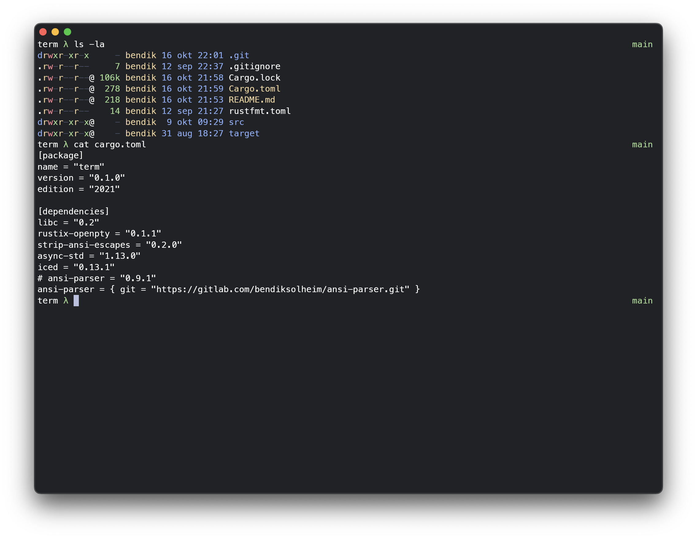

# term

A toy terminal emulator. Implemented to understand how these things actually work.
Written in Rust, with [iced](https://iced.rs).

## Usage

- Install Rust - [Rustup](https://rustup.rs/)
- Run with `cargo run`

## Resources

- [ANSI escape code (Wikipedia)](https://en.wikipedia.org/wiki/ANSI_escape_code)
- [ANSI Escape Codes (gist)](https://gist.github.com/fnky/458719343aabd01cfb17a3a4f7296797)
- [XTerm Control Sequences](https://invisible-island.net/xterm/ctlseqs/ctlseqs.html)

### TODO

- Research [winnow](https://crates.io/crates/winnow) as an alternative to nom
